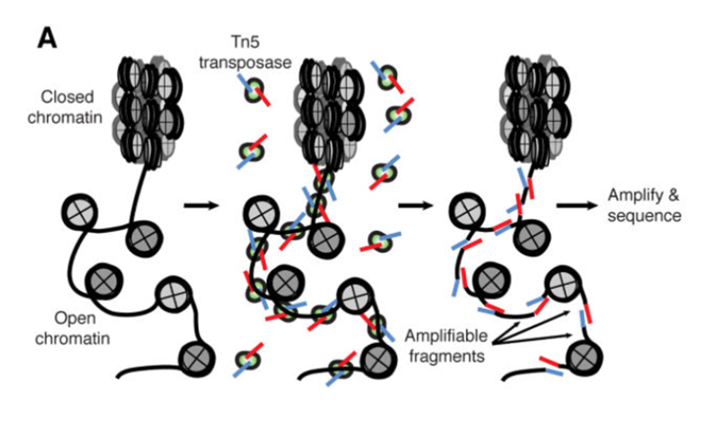
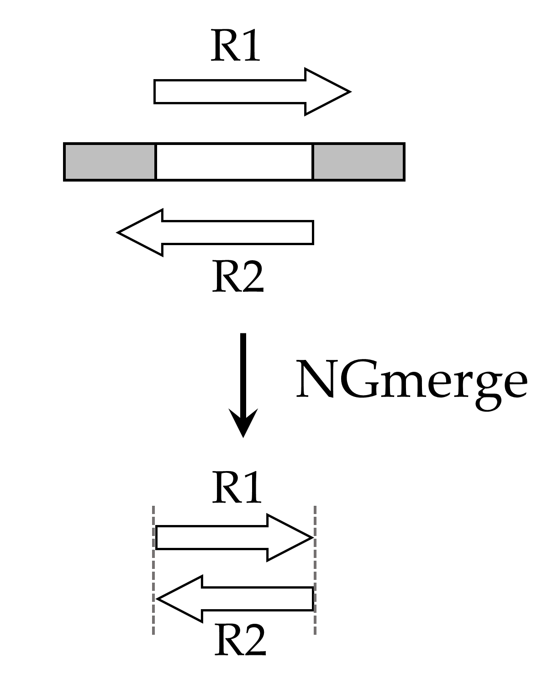
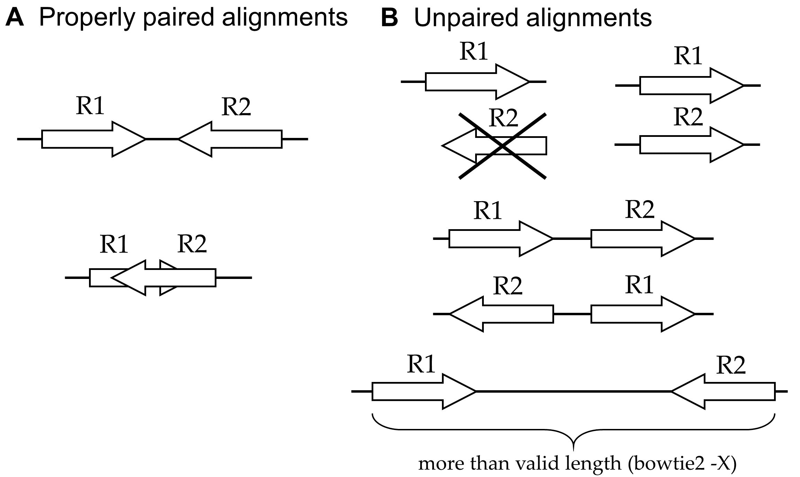
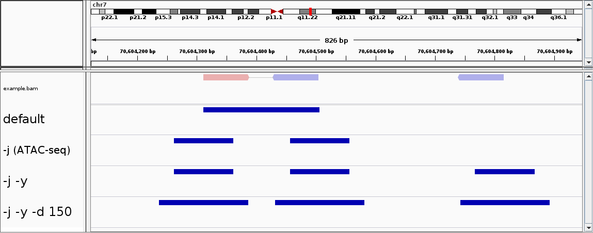

## Table of Contents
[ATAC-seq overview](#overview)<br>
[Experimental design](#design)<br>
[Compute access / Odyssey](#odyssey)<br>
[Sequence reads](#reads)<br>
[Quality control](#qc)<br>
[Alignment](#alignments)<br>
[Peak-calling](#peak)<br>
[Next steps](#next)<br>
[References](#references)<br>

### NOTE: this is an updated version of the ATAC-seq Guidelines.  The original version can be found [here](https://informatics.fas.harvard.edu/atac-seq-guidelines-old.html).

## ATAC-seq overview<a name="overview"></a>

ATAC-seq (Assay for Transposase-Accessible Chromatin with high-throughput sequencing) is a method for determining chromatin accessibility across the genome.  It utilizes a hyperactive Tn5 transposase to insert sequencing adapters into open chromatin regions (Fig. 1).  High-throughput sequencing then yields reads that indicate these regions of increased accessibility.

<figure>
  
  <figcaption><strong>Figure 1.  ATAC-seq overview</strong> (<a href="https://www.ncbi.nlm.nih.gov/pmc/articles/PMC4374986/">Buenrostro <i>et al.</i>, 2015</a>).</figcaption>
</figure>
<br>

## Experimental design<a name="design"></a>

The developers of the ATAC-seq method have published a [detailed protocol](https://www.ncbi.nlm.nih.gov/pmc/articles/PMC4374986/) for the laboratory procedure (Buenrostro *et al.*, 2015).

Here are a few additional things to consider when planning an ATAC-seq experiment:

### 1. Replicates

Like most high-throughput sequencing applications, ATAC-seq requires that biological replicates be run.  This ensures that any signals observed are due to biological effects and not idiosyncracies of one particular sample or its processing.  To begin with, two replicates per experimental group are sufficient.

### 2. Controls

With ATAC-seq, control groups are not typically run, presumably due to the expense and the limited value obtained.  A control for a given sample would be genomic DNA from the sample that, instead of transposase treatment, is fragmented (e.g. by sonication), has adapters ligated, and is sequenced along with the ATAC sample.  Such a control could be useful to help define regions of the genome that are more challenging to sequence or to align reads unambiguously.

### 3. PCR amplification

In preparing libraries for sequencing, the samples should be amplified using as few PCR cycles as possible.  This helps to reduce PCR duplicates, which are exact copies of DNA fragments that can interfere with the biological signal of interest.

### 4. Sequencing depth

The optimal sequencing depth varies based on the size of the reference genome and the degree of open chromatin expected.  For studies of human samples, [Buenrostro *et al.* (2015)](https://www.ncbi.nlm.nih.gov/pmc/articles/PMC4374986/) recommend more than 50 million mapped reads per sample.

### 5. Sequencing mode

For ATAC-seq, we recommend **paired-end sequencing**, for several reasons.

* More sequence data leads to better alignment results.  Many genomes contain numerous repetitive elements, and failing to align reads to certain genomic regions unambiguously renders those regions less accessible to the assay.  Additional sequence data, such as with paired-end sequencing, helps to reduce these alignment ambiguities.

* With ATAC-seq, we are interested in knowing both ends of the DNA fragments generated by the assay, since the ends indicate where the transposase inserted.  This can be done *only* with paired-end reads.  A single-end read defines only one end of the fragment, and, although computational methods to infer fragment lengths from single-end reads exist, they tend to be inaccurate.

* PCR duplicates are identified more accurately.  As noted above, PCR duplicates are artifacts of the procedure, and they should be removed as part of the analysis pipeline (see below for more details).  However, computational programs that remove PCR duplicates (e.g. [Genrich](https://github.com/jsh58/Genrich#pcr-duplicate-removal)) typically identify duplicates based on comparing ends of aligned reads.  With single-end reads, there is only one position to compare, and so any reads whose 5' ends match are considered duplicates.  Thus, many false positives may result, and perfectly good reads are removed from further analysis.  On the other hand, after paired-end sequencing, both ends of the original DNA fragments are defined.  To be declared a duplicate, both ends of one fragment need to match both ends of another fragment, which is far less likely to occur by chance.  Therefore, paired-end sequencing leads to fewer false positives.

### 6. Mitochondria

It is a well-known problem that ATAC-seq datasets usually contain a large percentage of reads that are derived from mitochondrial DNA (for example, see [this discussion](http://seqanswers.com/forums/showthread.php?t=35318)).  Since there are no ATAC-seq peaks of interest in the mitochondrial genome, these reads are discarded in the computational analysis and thus represent a waste of sequencing resources.  The [Omni-ATAC method](https://www.nature.com/articles/nmeth.4396) uses detergents to remove mitochondria from the samples prior to sequencing and is likely to be accessible for most researchers.


## Compute access / Odyssey<a name="odyssey"></a>

This document assumes that you have an account on the [Odyssey computer cluster](https://www.rc.fas.harvard.edu/training/introduction-to-odyssey-online/) of Harvard University.  An account can be requested [here](https://portal.rc.fas.harvard.edu/request/account/new).

Programs, like those listed below (e.g. FastQC, Bowtie2, Genrich), are run on Odyssey by submitting jobs via the [SLURM management system](https://www.rc.fas.harvard.edu/resources/running-jobs/).
The jobs take the form of shell scripts, which are submitted with the [sbatch command](https://www.rc.fas.harvard.edu/resources/running-jobs/#Submitting_batch_jobs_using_the_sbatch_command).  The shell scripts request computational resources (time, memory, and number of cores) for a job; it is better to request more resources than expected, rather than risk having a job terminated prematurely for exceeding its limits.


## Sequence reads<a name="reads"></a>

The raw sequence files generated by the sequencing core are in [FASTQ format](https://en.wikipedia.org/wiki/FASTQ_format).  They are gzip-compressed, with `.gz` file extensions.  It is unnecessary, not to mention wasteful of time and disk space, to decompress the sequence files; all common bioinformatics tools can analyze compressed files.

For paired-end sequencing, there are two files per sample: `<sample>.R1.fastq.gz` and `<sample>.R2.fastq.gz`.

Samples that were sequenced on multiple lanes may have separate files for each lane; these should be concatenated using the `cat` command:

```
cat  <sample>.lane1.R1.fastq.gz  <sample>.lane2.R1.fastq.gz  >  <sample>.R1.fastq.gz
cat  <sample>.lane1.R2.fastq.gz  <sample>.lane2.R2.fastq.gz  >  <sample>.R2.fastq.gz
```

However, different replicates should not be concatenated, but instead should be processed separately.


## Quality control<a name="qc"></a>

### FastQC

It is generally a good idea to generate some quality metrics for your raw sequence data.  One tool that is commonly used for this purpose is [FastQC](https://www.bioinformatics.babraham.ac.uk/projects/fastqc/).

On Odyssey, each sequence file would be analyzed like this:

```
module load fastqc
fastqc <sample>.R1.fastq.gz
```

FastQC is efficient; it can process a file of 20 million reads in about 5 minutes with less than 250MB memory used.  The output from FastQC is an HTML file, which can be examined via a web browser.  The report lists various statistics about your reads, such as their count and lengths.  It also provides graphical representations of your data based on a number of categories, including quality scores, GC levels, PCR duplicates, and adapter content.

The FastQC report is there to alert you to potential issues with your data, but it is not the final determinant of the outcome of your ATAC-seq experiment.  Do not be overly concerned if your FastQC reports contain one or more red 'X' marks; this is not a reason to delete your data and start all over again.


### Adapter removal

For reads derived from short DNA fragments, the 3' ends may contain portions of the Illumina sequencing adapter.  This adapter contamination may prevent the reads from aligning to the reference genome and adversely affect the downstream analysis.  If you suspect that your reads may be contaminated with adapters (either from the FastQC report ["Overrepresented sequences" or "Adapter content" sections], or from the size distribution of your sequencing libraries), you should run an adapter removal tool.  Here are two options:

#### 1. Cutadapt

One of the most widely used adapter removal programs is [cutadapt](http://cutadapt.readthedocs.io/en/stable/guide.html).  Cutadapt searches input reads for a given adapter sequence.  When it finds the adapter, it removes the adapter and everything that follows it.  Reads that do not match the adapter remain unaltered.

Some things to note when using cutadapt:

* The adapter sequences need to be provided via the `-a` argument.  If you do not know which adapters were used for your samples, consult the sequencing core.

* Cutadapt attempts to match a minimal length of the provided adapter sequence.  The default value for this argument (`-O`) is 3bp.  The downside of using such a small value is the possibility of false positives (trimming reads' good sequences that happen to match part of the adapter).  On the other hand, increasing this parameter results in more false negatives, since reads with adapter contamination may contain sequencing errors that prevent a match.

#### 2. NGmerge

An alternative approach to adapter removal is provided by [NGmerge](https://bmcbioinformatics.biomedcentral.com/articles/10.1186/s12859-018-2579-2), which was developed in the Informatics Group.  Unlike cutadapt, NGmerge does not require that the adapter sequences be provided, nor does it require a parameter for the minimum length of adapter to match (in fact, it does not perform adapter matching at all).  However, it works only with paired-end sequencing, so those with single-end sequencing should stick with cutadapt.

NGmerge is based on the principle that, with paired-end sequencing, adapter contamination occurs only when both reads fully overlap.  The program aligns each pair of reads, and in cases where they align with 3' overhangs ("dovetailed"), it clips the overhangs of both reads (Fig. 2).  Reads that align without 3' overhangs (or do not align at all) remain unaltered.

<figure>
  
  <figcaption><strong>Figure 2.  Adapter removal by NGmerge.</strong>  The original DNA fragment contains sequencing adapters on both ends (gray boxes).  Because the fragment is short, the paired-end reads (R1, R2) extend into the sequencing adapters.  NGmerge aligns the reads, and clips the 3' overhangs.</figcaption>
</figure>
<br><br>

NGmerge is available on Odyssey:

```
module load NGmerge
NGmerge  -a  -1 <sample>.R1.fastq.gz  -2 <sample>.R2.fastq.gz  -o <name>  -v
```

The output files are `<name>_1.fastq.gz` and `<name>_2.fastq.gz`.  Of the many arguments available with NGmerge, here are the most important ones for this application:

<table>
  <tr>
    <th align="center">Argument</th>
    <th>Description</th>
  </tr>
  <tr>
    <td align="center"><code>-a</code></td>
    <td>Adapter-removal mode (<strong>must</strong> be specified)</td>
  </tr>
  <tr>
    <td nowrap align="center"><code>-e &lt;int&gt;</code></td>
    <td>Minimum length of overlap, i.e. the minimum DNA fragment length (default 50bp)</td>
  </tr>
  <tr>
    <td align="center"><code>-n &lt;int&gt;</code></td>
    <td>Number of cores on which to run</td>
  </tr>
  <tr>
    <td align="center"><code>-v</code></td>
    <td>Verbose mode</td>
  </tr>
</table>

For more information about the parameters and options of NGmerge, please consult the [homepage](https://github.com/harvardinformatics/NGmerge) on GitHub.

For input files of 20 million paired reads, NGmerge should run in less than one hour on a single core, with minimal memory usage.  Of course, the run-time decreases with more cores (`-n`).

Other than adapter removal, we do not recommend any trimming of the reads.  Such adjustments can complicate later steps, such as the identification of PCR duplicates.


## Alignment<a name="alignments"></a>

The next step is to align the reads to a reference genome.  There are many programs available to perform the alignment.  Two of the most popular are [BWA](http://bio-bwa.sourceforge.net/bwa.shtml) and [Bowtie2](http://bowtie-bio.sourceforge.net/bowtie2/manual.shtml).  We will focus on Bowtie2 here.

### Genome indexing

In order to align reads to a genome, the reference sequence must be indexed.  This is a time- and memory-intense procedure, but it needs to be done only once for a given genome.

For many model organisms, the genome and pre-built reference indexes are available from [iGenomes](https://support.illumina.com/sequencing/sequencing_software/igenome.html).  Otherwise, Bowtie2 indexes are made from a FASTA genome file using the program `bowtie2-build`:

```
module load bowtie2
bowtie2-build  <genome.fa>  <genomeIndexName>
```

### Alignment

Once the indexes are built, the reads can be aligned using Bowtie2.  A brief look at the [manual](http://bowtie-bio.sourceforge.net/bowtie2/manual.shtml) reveals the large number of parameters and options available with Bowtie2.  Here are a few that may benefit the alignment of an ATAC-seq dataset on Odyssey:

<table>
  <tr>
    <th align="center">Argument</th>
    <th>Description</th>
  </tr>
  <tr>
    <td align="center"><code>-X &lt;int&gt;</code></td>
    <td>Maximum DNA fragment length (default 500bp).  If you anticipate that you may have DNA fragments longer than the default value, you should increase this parameter accordingly; otherwise, alignments from such fragments are considered not properly paired (see Fig. 3B below).</td>
  </tr>
  <tr>
    <td nowrap align="center"><code>--very-sensitive</code></td>
    <td>Bowtie2 has a number of alignment and effort parameters that interact in complex (and sometimes unexpected) ways.  Preset collections of these parameters are provided for convenience; the default is <code>--sensitive</code>, but better alignment results are frequently achieved with <code>--very-sensitive</code>.</td>
  </tr>
  <tr>
    <td align="center"><code>-k &lt;int&gt;</code></td>
    <td>Maximum number of alignments to report per read.  By default, Bowtie2 reports at most one alignment per read, and if multiple equivalent alignments exist, it chooses one randomly.</td>
  </tr>
  <tr>
    <td align="center"><code>-p &lt;int&gt;</code></td>
    <td>Number of cores on which to run</td>
  </tr>
</table>

The output is a [SAM file](https://samtools.github.io/hts-specs/SAMv1.pdf), which contains alignment information for each input read.  The SAM should be compressed to a binary format (BAM) and sorted by queryname with [SAMtools](http://www.htslib.org/doc/samtools.html).  This is best accomplished by piping the output from Bowtie2 directly to `samtools view` and `samtools sort`, e.g.:

```
module load bowtie2   # if not already loaded
module load samtools
bowtie2  --very-sensitive  -k 10  -x <genomeIndexName>  -1 <name>_1.fastq.gz  -2 <name>_2.fastq.gz  \
  |  samtools view  -u  -  \
  |  samtools sort  -n  -o <BAM>  -
```

For input files of 20 million paired reads, this command takes around five hours on Odyssey.  This can be decreased by increasing the number of cores in the Bowtie2 command.  For example, one could specify eight cores for Bowtie2 with `-p 8` and adjust the request in the SLURM script to `#SBATCH -n 10` (that is, eight cores for Bowtie2 and one each for SAMtools view and sort).  The memory usage of Bowtie2 depends primarily on the genome length; enough must be requested to load the genome indexes.

Bowtie2 also provides (via `stderr`) a summary of the mapping results, separated according to uniqueness and alignment type (concordant, discordant, and non-concordant/non-discordant).  In terms of alignment interpretation, it is conceptually easier to divide alignments into two basic categories: properly paired and unpaired (Fig. 3).

<figure>
  
  <figcaption><strong>Figure 3.  Alignment types for paired-end reads.  A:</strong> Properly paired alignments ("concordant") have the reads aligned in opposite orientations on the same reference sequence (chromosome).  The reads may overlap to some extent (bottom).  <strong>B:</strong> A read alignment (for R1) can be unpaired for several reasons: if the read's mate (R2) is unaligned (upper left), aligns to a different chromosome (upper right), aligns in the incorrect orientation (middle cases), or aligns in the correct orientation but at an invalid distance (bottom).  In all cases except the upper left, the R2 read alignment is also unpaired, and the read pair align discordantly (though Bowtie2 also requires uniqueness for such alignments to be counted as discordant).</figcaption>
</figure>
<br>


## Peak-calling<a name="peak"></a>

**NOTE:** Our current recommendation is to call peaks with [Genrich](https://github.com/jsh58/Genrich), which was developed in the Informatics Group.  The program has been tested extensively but is not currently published.  The previous version of these guidelines, which included multiple steps of alignment filtering and wrangling, and peak-calling with [MACS2](https://github.com/taoliu/MACS), is available [here](https://informatics.fas.harvard.edu/atac-seq-guidelines-old.html).

### Another peak-caller?  Why???

[Genrich](https://github.com/jsh58/Genrich) was designed to be able to run all of the post-alignment steps through peak-calling with **one command**.  It also possesses a few novel features.  Consider the following attributes:

<ul>
  <li>
    <p><strong>Removal of mitochondrial reads</strong>.  As stated previously, reads derived from mitochondrial DNA represent noise in ATAC-seq datasets and can substantially inflate the background level.  Genrich disregards all alignments to the mitochondrial chromosome with <a href="https://github.com/jsh58/Genrich#eparam"><code>-e chrM</code></a>, for example.</p>
  </li>
  <li>
    <p><strong>Removal of PCR duplicates</strong>.  PCR duplicates are artifacts of the library preparation procedure, and they should be eliminated from consideration.  Genrich follows a <a href="https://github.com/jsh58/Genrich#pcr-duplicate-removal">systematic procedure</a> to remove PCR duplicates with <code>-r</code>.  Note that this evaluation takes into account multimapping reads (see next), which is not provided by other alignment-based duplicate-removal programs, such as Picard's <a href="http://broadinstitute.github.io/picard/command-line-overview.html#MarkDuplicates" rel="nofollow">MarkDuplicates</a>.</p>
  </li>
  <li>
    <p><strong>Analysis of multimapping reads</strong>.  It is not uncommon for short sequence reads to align equally well to multiple locations in a reference genome, especially given the repetitive nature of genomes.  Non-uniquely aligned reads can be removed by filtering based on MAPQ scores with <code>samtools</code>, but this effectively renders certain genomic regions inaccessible to the assay.  With Genrich, <a href="https://github.com/jsh58/Genrich#multimapping-reads">reads with multiple alignments are analyzed</a> by adding a fractional count to each location.  Genrich's <a href="https://github.com/jsh58/Genrich#p-value-calculation">statistical model</a> accommodates these values.</p>
    <p>Along these same lines, Genrich considers the entire reference genome to be part of the assay.  If there are chromosomes or genomic regions that should be excluded from analysis, these can be specified by <a href="https://github.com/jsh58/Genrich#eparam"><code>-e</code> or <code>-E</code></a>, and Genrich will adjust the <a href="https://github.com/jsh58/Genrich#genome-length-calculation">genome length calculation</a> accordingly.  There is no need to <a href="https://github.com/taoliu/MACS#-g--gsize">guesstimate an "effective" genome size</a> like with MACS2.</p>
  </li>
  <li>
    <p><strong>Analysis of multiple replicates</strong>.  When alignment files for multiple replicates are provided to Genrich, it <a href="https://github.com/jsh58/Genrich#multiple-replicates">calls peaks for the replicates collectively</a>.  No more IDR.  Done.</p>
  </li>
  <li>
    <p><strong>Interpretation of alignments suitable for ATAC-seq</strong>.  Genrich provides an <a href="https://github.com/jsh58/Genrich#atac-seq-mode">ATAC-seq analysis mode</a> (<code>-j</code>) in which, rather than inferring the full fragments from the alignments, intervals are interpreted that are centered on transposase cut sites (the ends of each DNA fragment).  Only properly paired alignments are analyzed by default, but there is an option to consider unpaired alignments as well (<code>-y</code>) (Fig. 4).</p>
  </li>
</ul>

<figure>
  
  <figcaption><strong>Figure 4.  ATAC-seq mode of Genrich.</strong>  With <code>-j</code>, Genrich analyzes intervals centered on transposase cut sites (both ends of full fragments, as well as the 5' ends of unpaired alignments if <code>-y</code> is set).  The lengths of the intervals can be changed from the default of <code>-d 100</code>.</figcaption>
</figure>
<br><br>

Our previous recommendation was to run MACS2 with [`-f BAMPE`](https://github.com/taoliu/MACS#bedpe-or-bampe), which is similar to the default analysis mode of Genrich (inferring full fragments, rather than cut site intervals).  Others have attempted to interpret cut site intervals with MACS2 by using the [`--shift`](https://github.com/taoliu/MACS#--shift) and [`--extsize`](https://github.com/taoliu/MACS#--extsize) arguments, but these arguments are ignored in `BAMPE` mode.  They do work in the default (`BAM`) mode, but then, with paired-end reads, [most of the alignments are automatically discarded](https://www.biorxiv.org/content/early/2018/12/17/496521) (half of the properly paired alignments and *all* of the unpaired alignments; secondary alignments are *never* considered).  Is it worse to interpret full fragments that may be less informative biologically, or to disregard more than half of the sequence data?  A complicated question.  The correct answer is: **use Genrich**.


### Genrich

Running all post-alignment steps with a single command requires the availability of [many command-line arguments](https://github.com/jsh58/Genrich#usage-message).  Here are the most important parameters and options of Genrich for analyzing ATAC-seq experiments:

<table>
  <tr>
    <th align="center">Argument</th>
    <th>Description</th>
  </tr>
  <tr>
    <td align="center"><code>-j</code></td>
    <td>ATAC-seq mode (<strong>must</strong> be specified)</td>
  </tr>
  <tr>
    <td align="center"><code>-d &lt;int&gt;</code></td>
    <td>Expand cut sites to the given length (default 100bp)</td>
  </tr>
  <tr>
    <td align="center"><code>-y</code></td>
    <td>Analyze unpaired alignments</td>
  </tr>
  <tr>
    <td align="center"><code>-r</code></td>
    <td>Remove PCR duplicates</td>
  </tr>
  <tr>
    <td align="center"><code>-e &lt;arg&gt;</code></td>
    <td>Chromosomes (reference sequences) to exclude.  Can be a comma-separated list, e.g. <code>-e chrM,chrY</code>.</td>
  </tr>
  <tr>
    <td align="center"><code>-E &lt;file&gt;</code></td>
    <td>Input BED file(s) of genomic regions to exclude, such as 'N' homopolymers or high mappability regions</td>
  </tr>
  <tr>
    <td align="center"><code>-q &lt;float&gt;</code></td>
    <td>Maximum <i>q</i>-value (FDR-adjusted <i>p</i>-value) for peak calling (default 0.05).  An unadjusted <i>p</i>-value threshold can be used instead with <code>-p &lt;float&gt;</code>.</td>
  </tr>
  <tr>
    <td nowrap align="center"><code>-a &lt;float&gt;</code></td>
    <td>Minimum area under the curve (total significance) for a peak (default 20.0).  Increasing this value results in fewer but higher confidence peaks.</td>
  </tr>
  <tr>
    <td align="center"><code>-v</code></td>
    <td>Verbose mode</td>
  </tr>
</table>


Here is a command to call peaks from a single BAM file on Odyssey:

```
module load Genrich
Genrich  -t <BAM>  -o <OUT>  -j  -y  -r  -e chrM  -v
```

The alignment files for multiple replicates can be given to Genrich in a comma-separated list, e.g. `-t <BAM1>,<BAM2>`.

The output file produced by Genrich is in [ENCODE narrowPeak format](https://genome.ucsc.edu/FAQ/FAQformat.html#format12), listing the genomic coordinates of each peak called and various statistics.

In [this example](https://github.com/jsh58/Genrich#full-analysis-example), a single BAM containing 146.3 million alignments was analyzed by Genrich in 10.5min with 17.1GB of memory on Odyssey.  In general, input BAM(s) of more alignments take longer to analyze, but the memory usage should not increase greatly.  Note that Genrich is not multithreaded, so it runs on a single core only.

Those who wish to explore the results of varying the [peak-calling parameters](https://github.com/jsh58/Genrich#peak-calling-parameters) (`-q`/`-p`, `-a`, `-l`, `-g`) should consider having Genrich produce a log file when it parses the SAM/BAM files (for example, with `-f <LOG>` added to the above command).  Then, Genrich can call peaks directly from the log file with the [`-P` option](https://github.com/jsh58/Genrich#pparam):

```
Genrich  -P  -f <LOG>  -o <OUT2>  -p 0.01  -a 200  -v
```

This uses minimal memory and much less time than running the full analysis.


## Next steps<a name="next"></a>

Once the peaks have been identified by Genrich for a set of samples, there are several follow-up steps that can be taken, depending on the experimental design. 

### Visualization

Some researchers find it useful to generate visualizations of the peaks in a genomic context.

For ATAC-seq in model organisms, the peak file produced by Genrich can be uploaded directly to the [UCSC genome browser](https://genome.ucsc.edu/cgi-bin/hgCustom).  Note that a peak file without a header line should have the following added to the beginning of the file:

```
track type=narrowPeak
```

An alternative visualization tool is the [Integrative Genomics Viewer](http://software.broadinstitute.org/software/igv/) (IGV).  Peak files can be loaded directly (File → Load from File).  Viewing BAM files with IGV requires that they be sorted *by coordinate* and indexed using [SAMtools](http://www.htslib.org/doc/samtools.html).  Note that the BAMs show the read alignments, but not the full fragments generated by the ATAC nor the cut site intervals analyzed by Genrich.  To view the intervals, one can use the optional output BED file produced by Genrich with `-b`.


### Comparing peak files

Determining genomic regions that are common or different to a set of peak files is best accomplished with [BEDTools](http://bedtools.readthedocs.io/en/latest/index.html), a suite of software tools that enables "genome arithmetic."

For example, [bedtools intersect](http://bedtools.readthedocs.io/en/latest/content/tools/intersect.html) determines regions that are common to two peak files.  Finding differences between two peak files, such as control vs. experimental groups, is accomplished via [bedtools subtract](http://bedtools.readthedocs.io/en/latest/content/tools/subtract.html).


### Annotation

It is helpful to know what genomic features are near the peaks called by Genrich.  One program that is commonly used to annotate peaks is [ChIPseeker](https://bioconductor.org/packages/release/bioc/html/ChIPseeker.html).  ChIPseeker was originally designed to be used in the analysis of ChIP-seq, but it works just as well with ATAC-seq.

ChIPseeker requires that the genome of interest be annotated with locations of genes and other features.  The [ChIPseeker user guide](https://bioconductor.org/packages/release/bioc/vignettes/ChIPseeker/inst/doc/ChIPseeker.html) is extremely helpful in using this R/Bioconductor package.


### Motif finding

[HOMER](http://homer.ucsd.edu/homer/introduction/basics.html) is a suite of software designed for [motif discovery](http://homer.ucsd.edu/homer/ngs/peakMotifs.html).  It takes a peak file as input and checks for the enrichment of both known sequence motifs and de novo motifs.


## References<a name="references"></a>

Andrews S. (2010).  FastQC: a quality control tool for high throughput sequence data.  Available online at: http://www.bioinformatics.babraham.ac.uk/projects/fastqc

Buenrostro JD, Giresi PG, Zaba LC, Chang HY, Greenleaf WJ.  Transposition of native chromatin for fast and sensitive epigenomic profiling of open chromatin, DNA-binding proteins and nucleosome position.  Nat Methods. 2013 Dec;10(12):1213-8.

Buenrostro JD, Wu B, Chang HY, Greenleaf WJ.  ATAC-seq: A Method for Assaying Chromatin Accessibility Genome-Wide.  Curr Protoc Mol Biol. 2015 Jan 5;109:21.29.1-9.

Corces MR, Trevino AE, Hamilton EG, Greenside PG, Sinnott-Armstrong NA, Vesuna S, Satpathy AT, Rubin AJ, Montine KS, Wu B, Kathiria A, Cho SW, Mumbach MR, Carter AC, Kasowski M, Orloff LA, Risca VI, Kundaje A, Khavari PA, Montine TJ, Greenleaf WJ, Chang HY.  An improved ATAC-seq protocol reduces background and enables interrogation of frozen tissues.  Nat Methods. 2017 Oct;14(10):959-962.

Gaspar JM. Improved peak-calling with MACS2. bioRxiv. 2018 Dec 17. doi: http://dx.doi.org/10.1101/496521

Gaspar JM. NGmerge: merging paired-end reads via novel empirically-derived models of sequencing errors. BMC Bioinformatics. 2018 Dec 20;19(1):536.

Heinz S, Benner C, Spann N, Bertolino E, Lin YC, Laslo P, Cheng JX, Murre C, Singh H, Glass CK.  Simple combinations of lineage-determining transcription factors prime cis-regulatory elements required for macrophage and B cell identities.  Mol Cell. 2010 May 28;38(4):576-89.

Langmead B, Salzberg SL.  Fast gapped-read alignment with Bowtie 2.  Nat Methods. 2012 Mar 4;9(4):357-9.

Li H, Handsaker B, Wysoker A, Fennell T, Ruan J, Homer N, Marth G, Abecasis G, Durbin R; 1000 Genome Project Data Processing Subgroup.  The Sequence Alignment/Map format and SAMtools.  Bioinformatics. 2009 Aug 15;25(16):2078-9.

Martin M.  Cutadapt removes adapter sequences from high-throughput sequencing reads.  EMBnet.journal. 2011;17:10-2.

Quinlan AR.  BEDTools: The Swiss-Army Tool for Genome Feature Analysis.  Curr Protoc Bioinformatics. 2014 Sep 8;47:11.12.1-34.

Yu G, Wang LG, He QY.  ChIPseeker: an R/Bioconductor package for ChIP peak annotation, comparison and visualization.  Bioinformatics. 2015 Jul 15;31(14):2382-3.
